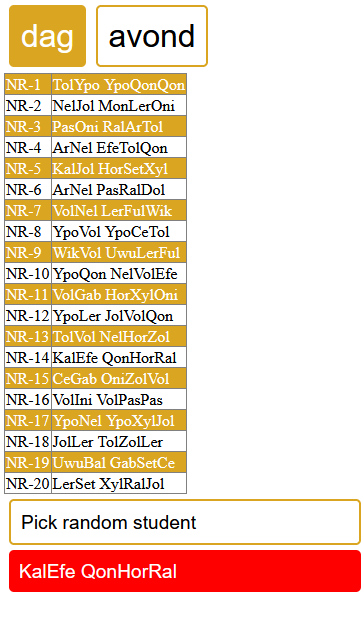

# Oefening 4

Werk verder op oefening 4 uit de oefeningen van les 1. We gaan onze applicatie voorzien van een grafische UI + enkele interactie elementen. Maak hierbij gebruik van html, js en css.

Kopieer je oefening in deze map. Of werk verder op de gegeven code.

## Stap 1

De 2 klassen in een html pagina laten zien.

- Print de 2 klassen op je scherm in een tabel.
- Maak 2 knoppen (mbv p tags) om tussen de 2 tabellen te kunnen switchen.
- Maak een knop (p tag) die er voor zorgt dat je een random student uit je tabel kan selecteren.

Hieronder zie je een voorbeeld van hoe dit er uit kan zien. Voel je vrij om zelf je layout te bepalen.

## Stap 2

Zelf klassen toevoegen

- Voorzie in html een knop (a tag) waarmee je zelf klassen kan toevoegen.
- Wanneer op de knop geklikt wordt, wordt er aan de hand van een [prompt](https://developer.mozilla.org/en-US/docs/Web/API/Window/prompt) (deze mag je uitzonderlijk gebruiken) volgende zaken gevraagd
  - Klasgrootte
  - dag of avond klas
- Toon de klas op het scherm
